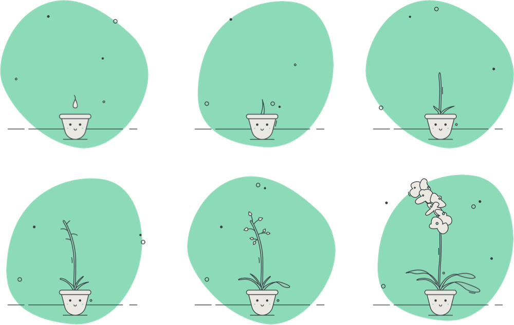
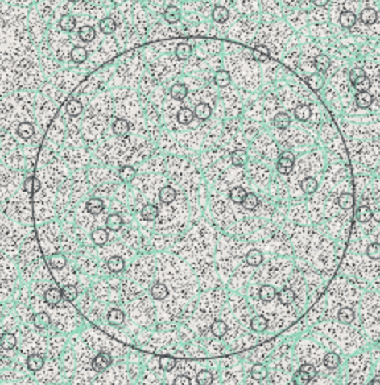
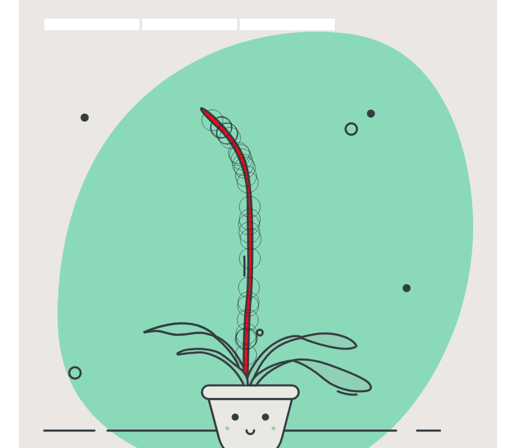
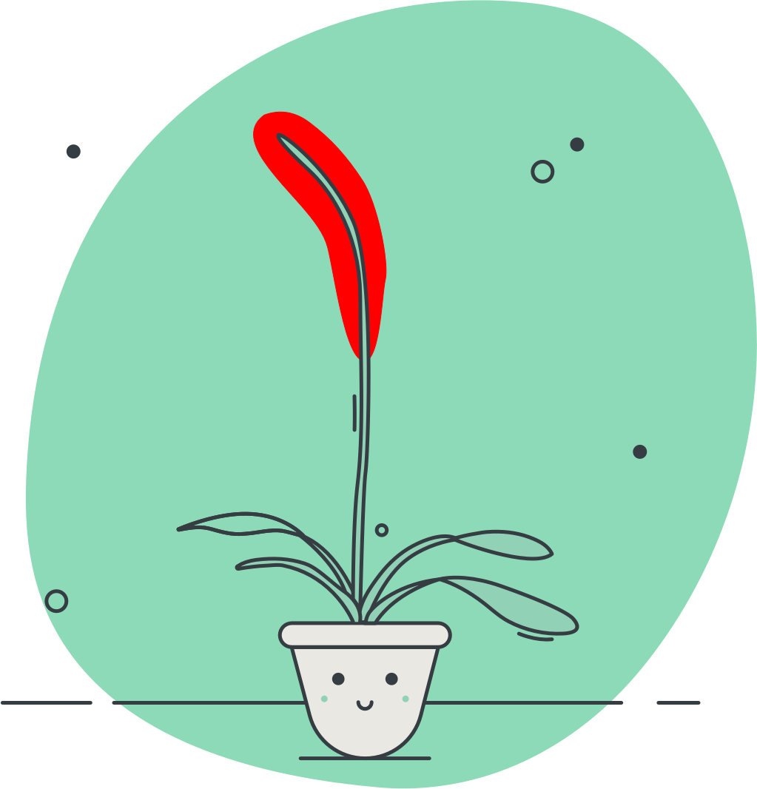
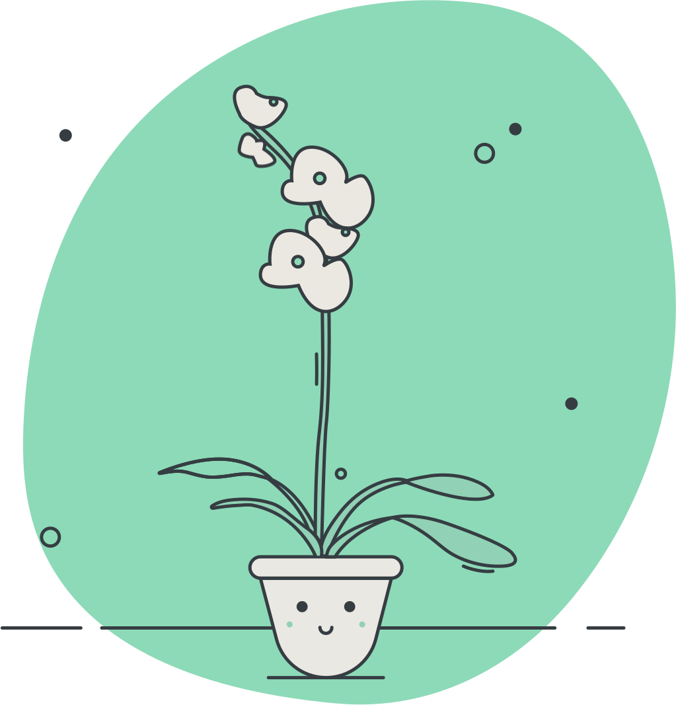

import { Highlight } from '../../../components/highlight'
import OatLogo from './oat.svg'

## The idea

I have this app I released in early 2020 named Oat. This app was all about sowing mindfulness into your daily routines. It worked well but the day to day usage of the app seemed more like a chore and the long term effects of using the app are tough to see due to the gradual change in behavior. That's when I had the idea of showing some type of progression in the app to show users some intermediate progress indicator and reward the user for using the app. I had a couple of things I wanted this feature to provide.

<Highlight
  title="Check out Oat"
  description="Available on the Google Play store"
  image={OatLogo}
  href="https://play.google.com/store/apps/details?id=com.oatmobile"
/>

- An analogy to usage of the application ( sowing the seeds of mindfulness )
- Allow the user to see a step by step progression of their usage
- Allow for sharing of this progress
- Make it unique enough for users that they are able to generate something new every day

I was able to get some beautiful illustrations of an orchid-like plant from [Aistegi](https://www.fiverr.com/aistegi) on [Fivver](https://www.fiverr.com/) and code up an alpha version of the app which gave me about 75% of what I wanted. The progress screen felt great, but after a week of progress, I had lost my desire to check out the progress screen.

This was at no fault of the design, or illustration, it's just that once I had achieved the final goal there was not much reason to achieve it again since it was the same thing every day. This pushed me even harder to pull off the last 25% of the project I wanted to achieve which is making it unique daily.

## Inspiration in games

I think there is a large number of correlations between what I wanted to achieve in my application and the things that games do to achieve replay-ability. There is a number of ways games do this, but one of the biggest is in generating unique items or content on each new play-through.

A couple of examples are how No Mans Sky will generate a universe, Binding of Isaac will generate new dungeons, Borderlands will generate new weapons, and how Minecraft will generate a whole new world. Minecraft has been a game that I started playing around 10 years ago and can still pick it up today and have a unique experience in the game. I wanted that experience on a smaller level in my application. I started to explore how these games generated this content, and how I could leverage those learning to build unique flowers for my users.

I have used an equation called **Perlin simplex** in the past to compile a map of random points, but for something like this I needed to use a very similar but different equation call **simplex noise**. The reason for this is that I would like to be able to consistently generate the same flower-based off a seed value. Essentially I should be able to throw that seed into simplex noise and get all the same points out of it. This was super beneficial when fine-tuning the look in the outcome.

## Building it out.

My process to generate these flowers is like most of my normal development process. I started off with a really rough assumption put a little code behind it a test and revise. Then I repeat the process over and over till I get something I am willing to turn into production code.

To support this my initial development environment is vastly different than my production environment due to the behavior and consistency I wanted for this feature. To start out I did everything in the browser. I used **create react app** and threw together a working page pretty quickly. The reason I started in the browser is that I wanted to have visuals of the system right away. The final images are not going to be generated in a React app but as long as I had that in mind I could make sure to not box myself into the react implementation.

## Iterate fast, iterate often

I started off with this hazy map of points, then I would place a larger circle on points that were above a certain number. The range of numbers that was generated by the simplex noise library I used gave me a range of **-2 to 2**. The threshold I used was 1.99, but quickly found a sweet spot around **1.9978**. This also introduced the first number I could change in the flower generation to be able to change the amount of points that a flower could grow. This number although a good one to change can only be changed slightly without getting out of control. Early on I also started drawing a area that I would want to pull points from. This was because I only wanted flowers in certain areas of the plant. This is a screen shot of what this looked like.

As you can see, I also drew on some lighter green lines, this was because I eventually wanted to add some padding to the flower so two flowers were not on top of each other. I needed at this point how to figure out how to find all the points inside of the larger circle. I looked up some equations on how this could be done, and most of them were pretty complicated. Luckily since this is not a game and I do not need the top performance I was able to sidestep this issue with something that ended up being super flexible and allowed me again to focus on the more visual aspect of what I wanted to do.

Essentially instead of trying to calculate where these points should be placed I just pulled the current pixel value from the canvas and based on a certain color being there I could draw the random points that are in the given color. Here is an early version of this.

This was actually a great change because it essentially allowed me to easily change the bounding box in Sketch and then just import the new image and it would work with zero code changes. Here is was the final version of the red area around the plant.

## Find what feels good

After this change, there was only a small amount of changes that were made to the actual code that was generating the points. I essentially pulled out a number of values from the actual code and passed them in as props to my component that was calculating all the points. This allowed me to essentially turn the knobs of my flower generated and find the best feeling flower generation.

I added a few inputs to change the seed of the flower generator, then also an input to adjust the padding around the flowers, and one last input to change the threshold of the points selected. These inputs allowed me to modify the way the flowers are generated and then test a bunch of different seeds with the settings. In the end product the **padding** and **threshold** values are going to be derived based on usage, so the more times you open the app the more flowers are generated, and the less times you open it the fewer flowers are generated. All the derived values have a pretty good looking output but just slightly different visuals. This is to almost give a data visualization on the usage of the app the is more art than bar graphs.

Another big change at this point was that I manually created more flowers, this was a better solution then rotating the existing flowers because it gave more variety to the flowers that could be generated. The original flowers were just based on the original image, but I was able to copy, rotate, and manipulate them until I had double the amount of flowers to play with.

## Saying bye to my code sandbox.

This React tool was super fun to play with and develop this feature, but it would not really make sense for the goal of this feature. I want to briefly go through the process of making this ready for prime time. One of the big goals of this was to allow users to generate these and then share out the results. To do this it meant that I needed to be able to have these images live in a place that is accessible to the outside world, and not just on the user's device. This means I could not only generate the flowers on the user's phone but would also need to generate it on the server. I actually opted to not generate them on the application at all because React Native, the framework the app is built in, is not super friendly with canvas, and also I would rather just generate the image of the server then pass the URL to the client. This way I could generate a number of images, and then throw them all up on s3 in a place that is ready to share.

To do this all I needed to do was take my client code and turn it into server code and luckily was pretty simple because I segmented all the main pieces of this functionality as pure functions. This allows most of the code to be easily transferable out of React land. I also have some prior knowledge of node-canvas which let me know some of my limitations when moving to a server-based canvas. I lose a lot of visibility into the processes that create these images by doing this, which is why I am doing this last after I have tuned the software. Luckily everything still worked after the conversion.

## Progression through creative coding

These types of projects are the ones that feed my soul. These projects envelop me in my code, and in minor details of my code that I probably would not otherwise dive this deep into. I always try to push myself to do these types of projects, or on the other side of work try to find creativity in my day to day projects as well. It works for me well, but I would also encourage you to try to find creativity in what you are doing with code. Push yourself into the crazy ideas, and not be afraid to sometime walk back those crazy ideas.

## Make your own flower today!

[Here](https://getoat.co/flowers/ebb921f8c8e293108629005a0d62c371c6115c38) is an example of the final product.

I am not sure if this is going to be a killer feature or not, you tell me. This change is now live in the [Play Store](https://play.google.com/store/apps/details?id=com.oatmobile) and available for download. If you're into mindfulness, or just want to create your own flower check it out!
